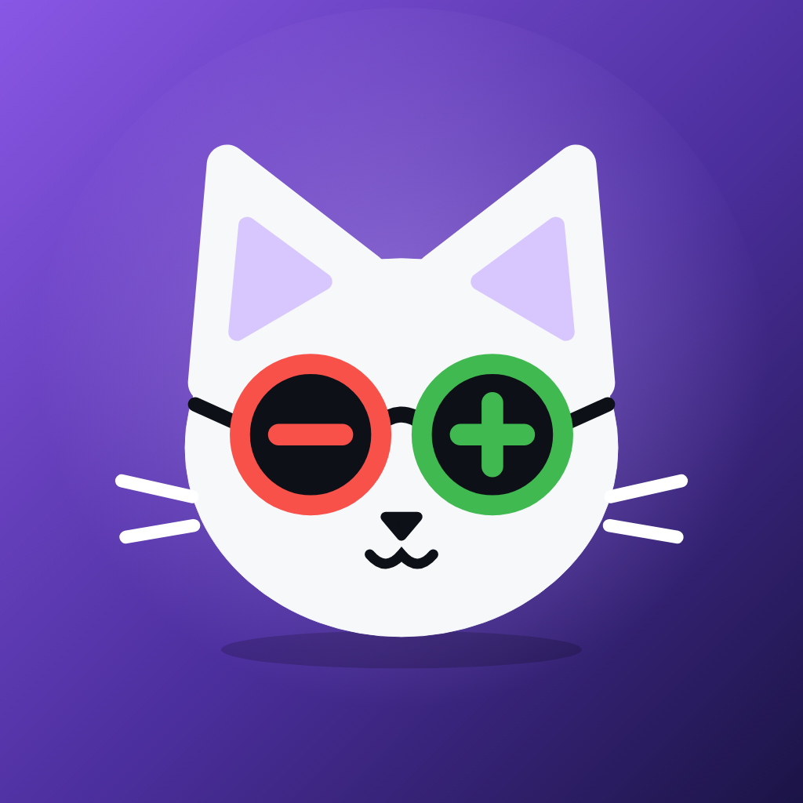

<p align="center"></p>

# Diffcat

Review GitHub code changes from your phone. No backend, no tracking: the app talks only to the GitHub API with
your own token if you sign in (optional: public repos work without an account), and to SSH hosts you add yourself.

- **Scrollable diffs:** lazily rendered, with pinned line numbers, horizontal pan or wrap, a jump-to-file list, and collapse/expand.
- **Folder tree:** compacted folders, path search, file viewer with line numbers, image preview.
- **File history:** every commit that touched a file. Tapping one opens the commit focused on that file.
- **Changed since commit X:** pick a commit or tag from a dropdown and get every changed file, then its diffs.
- **Pull requests:** overview, files and commits.
- **API console:** `git log/show/diff/since/ls/cat…` executed against GitHub. Nothing is cloned.
- **SSH terminal:** a real shell on your own machine for **lazygit** and anything else, with a mobile key toolbar and custom command buttons.
- **Notifications** for new commits and pull requests, checked on-device (no server). Tapping one opens the exact commit, range or PR.
- **Works offline:** download a branch (diffs, PRs, optionally every file) and read it with no connection.
- **Responsive:** phone → foldable → tablet and iPad (list/detail split, full-width toggle). Android and iOS/iPadOS.

## Install

- **Android APK:** download `diffcat-<version>.apk` from the [latest release](https://github.com/mohamadtout/diffcat/releases/latest)
  and open it (Android asks once to allow installs from your browser or file manager). Each release lists the file's
  SHA-256 so you can check the download. Updates install over it, keeping your data.
- **Google Play / App Store:** see the store listings once published.

The APK and the Google Play version are signed differently (Google signs Play installs), so Android won't update one
with the other: to switch, uninstall first, which clears the app's data.

```
app/        Flutter app (Android, iOS, iPadOS)
docs/       Architecture, features, commands, notifications, conventions, decisions, roadmap
```

## Quick start

```bash
make setup     # flutter pub get
make run       # run on a connected phone
make check     # format + analyze + all tests (what CI runs)
```

Then follow **[SETUP.md](SETUP.md)** for the GitHub token, notifications, SSH host and signing.

## Docs

- [Architecture](docs/architecture.md): layers, data flow, routing, git → API mapping
- [Features](docs/features.md): what each screen does and where its code lives
- [Commands](docs/commands.md): API console reference, SSH key notation, custom buttons
- [Notifications](docs/notifications.md): on-device polling and what triggers an alert
- [Conventions](docs/conventions.md): code style, testing, adding a feature
- [Decisions](docs/decisions.md) · [Roadmap](docs/roadmap.md)
- [Store listings](store/README.md) · [Privacy policy](PRIVACY.md)

Working with an AI agent? It should start at [CLAUDE.md](CLAUDE.md).

## License

Source-available under the [PolyForm Noncommercial License 1.0.0](LICENSE), with one extra condition.

- **Free** to use, study, modify and share for any noncommercial purpose.
- **No commercial use.** Don't sell the app or your changes, and don't use them to make money.
- **Use your own app ID.** If you distribute a build (app store, APK, anything), replace the reserved identifiers
  `com.mohamadtout.git_reviewer` (Android) and `com.mohamadtout.gitReviewer` (iOS) with your own.

See [LICENSE](LICENSE) for the binding terms. Third-party packages keep their own licenses.

Contributions are welcome. By opening a pull request you agree that your contribution is licensed under the same terms.
